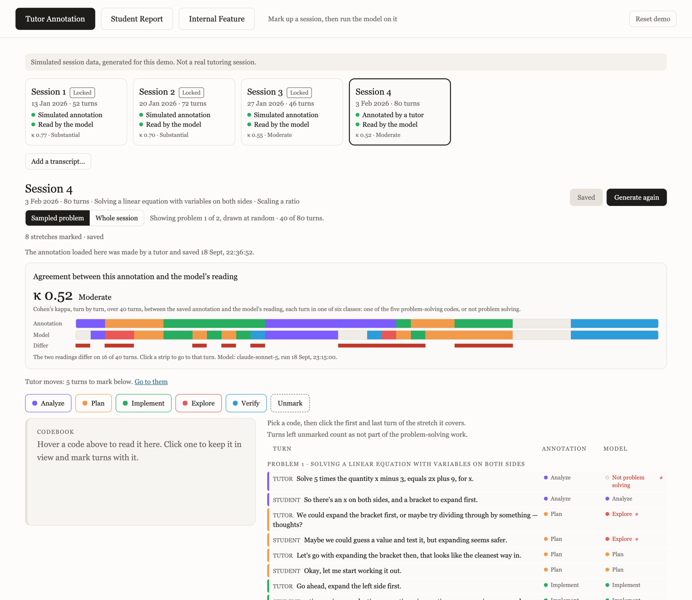
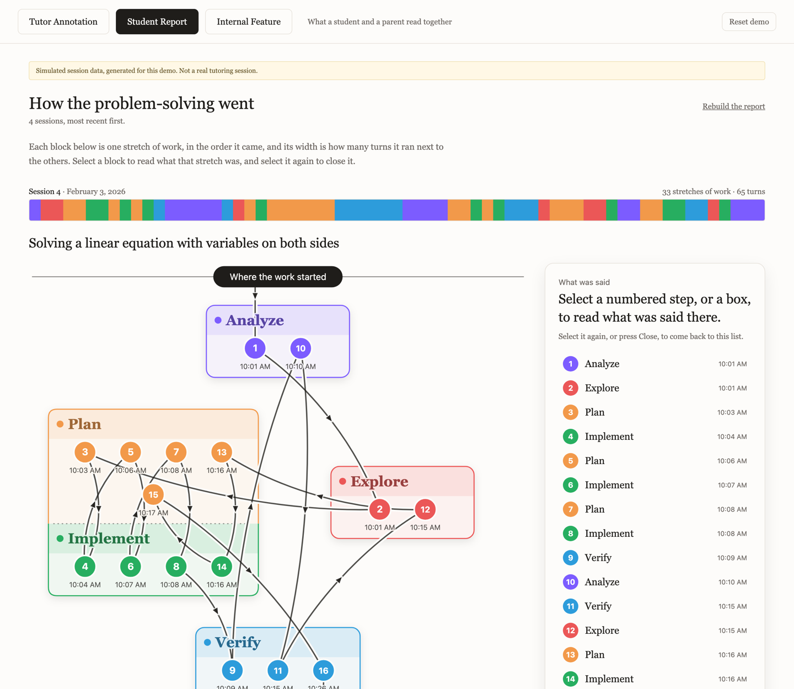
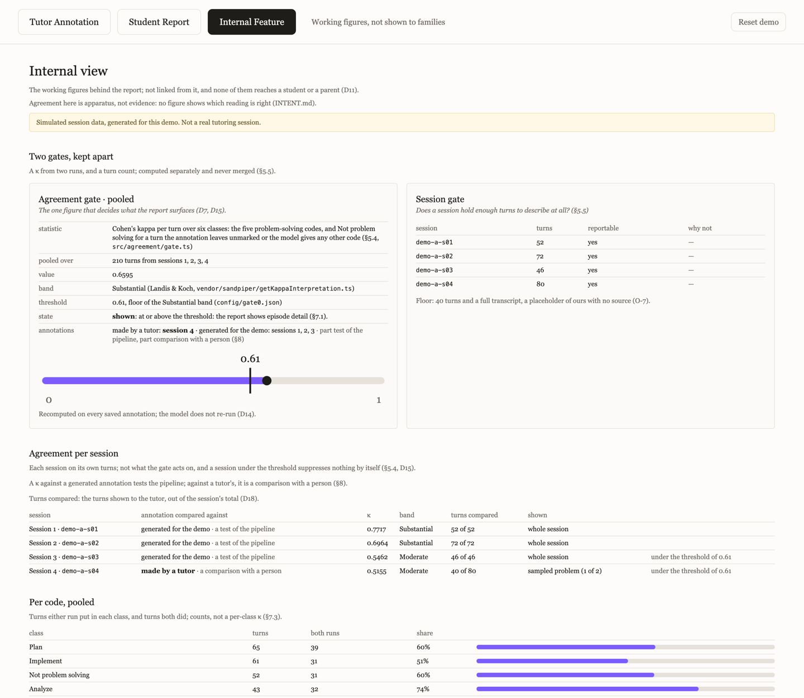

# problem-solving-report

A product prototype. It turns tutoring session transcripts into a learner- and
parent-facing report showing how the problem-solving process in a student's
sessions changed over time. It is meant to be read by a student and a parent
together, in about two minutes.

## What it does

Sizing a problem up, planning, trying something, checking it, backing out and
trying again: none of that survives a tutoring session. What is left is an
answer and, eventually, a grade. This project reads a session's transcript and
shows the work itself: which kinds of problem-solving work the session moved
through, in what order, for how long. Every step in the report links to the
turns behind it. The report describes the sessions and the work, never the
person, and draws no comparison across students.

Three screens:

- **Tutor Annotation.** A tutor marks the stretches of problem-solving work in
  a session, then has the model read the same session. Transcripts can be
  uploaded as CSV, JSONL or JSON.
- **Student Report.** What a student and a parent read together: the route each
  problem took through the kinds of work, each step linked to its turns.
- **Internal Feature.** The working figures a family never sees: agreement
  (Cohen's kappa) between the tutor's marking and the model's, and the gate it
  decides.

### The three screens

All data in these is simulated, as the banner in each says.

**Tutor Annotation** — a tutor marks the problem-solving stretches in one
sampled problem, then compares them with the model's reading turn by turn.



**Student Report** — what a student and a parent read: each problem's route
through the kinds of work, most recent session first, every step linked to the
turns behind it.



**Internal Feature** — the two gates, the pooled and per-session kappa, and the
per-code counts. None of it reaches the report.



**The analysis.** The unit is the episode: a contiguous span of turns, spanning
both speakers, during which the participants are doing one kind of
problem-solving work. There are nine codes, defined only in
`codebook.v2.json`. Five are the problem-solving work itself: the codes a tutor
marks and the only ones the report shows. The model uses all nine to segment a
session.

Agreement is Cohen's kappa at the turn level over six classes (the five codes,
plus one for everything else), per session and pooled over the report's
sessions. The pooled figure is compared with `AGREEMENT_THRESHOLD = 0.61`, the
floor of Landis & Koch's "substantial" band; below it, the episode layer does
not surface. With no annotation run there is nothing to compute, and the state
is `unmeasured`, shown as itself and never as a below-threshold result. The
figure stays in the internal view. It validates nothing: it is a number about
two label sequences, not evidence about the model or about a student.

**Layer 2** is separate. It codes one tutor turn: the turn immediately before a
problem-solving episode, in the model's run, that a student's turn opens. Its
five codes live in `codebook.tutor-moves.json`: three are taken by name from the
NTO Tutor Move Taxonomy (Zhou et al., 2026), two are ours. The authors report
Cohen's kappa for their full scheme of twenty-eight moves: .65 in the first
round and .78 in the second, after clarifications and minor alterations.
Neither figure is this layer's, and no agreement has been established for it
here. The layer has its own version, provenance card, kappa and gate, and is
never combined with the episode layer. On the report it adds "This stretch of
<kind> opened on the student's turn", and "with no prompt in the turn before
it" only where that turn is coded NONE and the layer's pooled kappa reaches
0.61.

## How it was built

- React 19, Vite and TypeScript, with Tailwind CSS.
- Server-side routes in a Vite plugin: `vite.config.ts` hands `/api/*` to
  `src/server/api.ts`. The API key is read from `.env` on the server and never
  reaches the page.
- The Anthropic API: Claude, model id `claude-sonnet-5` (`config/gate0.json`).
  At runtime it segments a session into episodes, classifies Layer 2's tutor
  turns, writes the report's summary and describes its quotes. It also wrote
  the demo sessions' dialogue, once and offline. Each run records its token
  usage and cache reads and writes. Counts are computed in code, never by the
  model.
- From NTO Sandpiper (MIT), two files vendored verbatim in `vendor/sandpiper/`:
  `calculateCohensKappa.ts`, wrapped by `src/agreement/kappa.ts`, which refuses
  unequal-length input and the degenerate single-code case instead of returning
  a wrong number; and `getKappaInterpretation.ts`, the Landis & Koch bands
  (which start "substantial" just above 0.60; the gate uses 0.61). The codebook
  structure, in part, and the turn-level transcript field names also follow
  Sandpiper. Its unit is a single utterance, with no representation for a span,
  so this project parts from it at the unit of analysis, on purpose
  (`docs/LAY-OF-THE-LAND.md` §3, `docs/DEVIATIONS.md`).

The code and documentation were written with heavy generative-AI assistance
(Claude Code). The project owner directed the work, reviewed it and made every
decision, each recorded in the repo's intent, spec and deviation log. At
runtime the app calls Claude, model id `claude-sonnet-5`.

## Built

14 to 18 September 2026. The earliest dated document is the Gate 0 brief of
2026-09-14; the spec, the plan and the deviation log carry dates up to
2026-09-18. The vendored Sandpiper files come from an upstream commit of
2026-09-08, which is Sandpiper's work, not this project's (`NOTICE`).

## Try it without an API key

Needs Node 22 (`.nvmrc`) and Yarn.

```sh
yarn install
yarn seed:live --clean    # the workspace, from the tracked data/demo and data/out
yarn dev                  # then open http://localhost:5173
```

All data is simulated: transcripts, starting annotations and the stored model
runs; every computation on them is real. Sessions 1 to 3 arrive with a
simulated annotation and a stored model run, and are locked. Session 4 is
untouched, and is where the loop is walked.

Works without a key: annotating and saving, the sampled problem and the
whole-session toggle, agreement against the stored model runs of sessions 1 to
3, the Internal Feature view, and Reset demo.

Needs a key (`ANTHROPIC_API_KEY` in `.env`, copied from `.env.example`):
Generate, Classify for Layer 2, and Build or Rebuild the report. A clean seed
carries no built report, so without a key, Student Report shows only that none
has been built yet.

## Guided walk (3 minutes)

Steps 3 and 5 need a key.

1. In **Tutor Annotation**, open **Session 4**. It opens on one sampled
   problem; **Whole session** shows the rest.
2. Pick a code, then click the first and last turn of the stretch it covers.
   Unmarked turns count as not problem solving.
3. Press **Save annotation**, then **Generate model reading**.
4. Open **Internal Feature**: kappa for session 4 (or the reason it is refused)
   and pooled, the gate's state, and the two tilings side by side. Only the
   turns shown to the tutor are compared.
5. Open **Student Report** and press **Build the report** (or **Rebuild the
   report**). Read it as a family would.
6. Click a numbered step on a problem's diagram to see the turns behind it.
7. Back in **Tutor Annotation**, change one stretch and press **Save
   annotation**. **Internal Feature** recomputes without running the model
   again, and Student Report lists what has changed since it was built.

## What it is not

Not a study. It is the apparatus for asking whether episode boundaries and
labels can be placed consistently enough to carry a claim, not an answer to
it. There is no annotator corps, and no reliability or validity is claimed for
either layer. The report makes no claim about a student's knowledge,
understanding, traits or progress, or about whether the tutor is good. Out of
scope: recommendations to students or parents, tutor evaluation or coaching,
predicting assessment outcomes, comparison or norming across students, and
inferring affect or engagement.

## Run it

Prerequisites: Node 22 (`.nvmrc`), Yarn, and an Anthropic API key in `.env` as
`ANTHROPIC_API_KEY` (copy `.env.example`). `.env` is gitignored; never commit a
key.

```sh
yarn install
yarn generate:demo        # the three simulated demo sets, into data/demo/
yarn seed:live --clean    # the workspace the site opens in, into data/live/
yarn dev                  # http://localhost:5173
```

The demo dialogue is written by a model once and stored in
`src/generator/dialogue/`; `yarn generate:demo` reads it and calls no model. To
write or refresh it:

```sh
yarn generate:demo --pool-lines   # only if the plan changed: refreshes the plan files
yarn write:dialogue               # one model call per session whose stored lines are missing or stale
yarn generate:demo                # rebuilds the sets with the stored lines
yarn pipeline demo-a              # and demo-b, demo-c
yarn seed:live --clean
```

`yarn write:dialogue demo-a` limits it to one set; `--force` rewrites lines that
are current. `yarn seed:live --clean` locks three of demo-a's four sessions
with their simulated annotation; they open with model runs only if
`data/out/demo-a/report.json` exists, so run the pipeline first. Reset demo
runs the same command.

Checks:

```sh
yarn typecheck
yarn validate
node --experimental-strip-types scripts/lint-wording.ts
node --experimental-strip-types scripts/check-agreement.ts
node --experimental-strip-types scripts/check-moves.ts
```

## Repository layout

| Path | What it is |
| --- | --- |
| `INTENT.md` | Why the repo exists and what it may claim. Wins over everything else. |
| `CLAUDE.md` | Standing rules: workflow, provenance tags, wording. |
| `codebook.v2.json` | The nine episode codes, the single source of every definition. |
| `codebook.tutor-moves.json` | Layer 2's five codes, versioned separately. |
| `config/gate0.json` | Every threshold, the data paths and the model id. |
| `docs/` | The Gate 0 spec and plan, Layer 2's spec, the unbuilt review-screen spec, the deviation log, `LAY-OF-THE-LAND.md`, `CITATIONS.md`, `SOURCES.md`, and reference material. |
| `schema/` | The data contract `yarn validate` enforces. |
| `src/`, `app/` | Codebook loader, agreement, model pipeline, Layer 2 (`src/moves/`), storage and server; the site. |
| `scripts/`, `lint/`, `test/fixtures/` | Commands and checks, the banned-phrase list, the validator's fixtures. |
| `vendor/sandpiper/` | The two files copied from Sandpiper. |
| `data/` | Demo sets and pipeline output (tracked); the live workspace `data/live/` (gitignored). |

## Attribution

Third-party files, their commit and licence are in `NOTICE`. Every source, its
licence and its use are in `docs/CITATIONS.md`.

## Next steps

Current as of 2026-09-18.

1. **Map the problem-solving trajectory across sessions**, session by session,
   never as a change in the person (needs a session floor and each layer's gate).
2. **Open decisions for the owner**: `CLAUDE.md` and intent corrections,
   codebook edits, thresholds, the schematic, a second Generate (`docs/SPEC-gate0.md` §11).
3. **Get tutor marks for Layer 2**; it stays `unmeasured` until then (D-027, D-031).
4. **Finish sampling**: smaller units, problem markers for uploads, Layer 2 on shown turns only, empty markings (O-34).
5. **Read the demo dialogue against its plans**; nothing in code checks it (D-034).
6. **Validate the model against tutors held out, measure episode boundaries, build the review screen** (O-18, `docs/SPEC-review.md`).
8. **Add a second domain** after the codebook's domain split; an EXTRAPOLATION until validated (O-4).
9. **Integrate specific tutor and student dialogue moves**: a separate layer with its own codebook and gate, from a licence-compatible published scheme.
