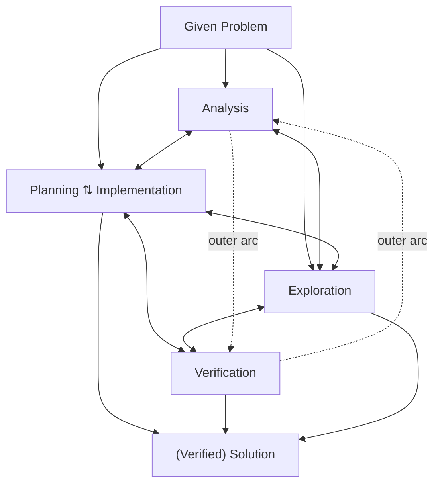

# Reference: Rott, Specht & Knipping (2021), Fig. 5

**Source.** Rott, B., Specht, B., & Knipping, C. (2021). A descriptive phase
model of problem-solving processes. *ZDM Mathematics Education*, 53(4),
737–752. Fig. 5, captioned "Descriptive model of problem-solving processes".

**Status.**

- The project owner supplied the figure in chat on 2026-09-17 as the design
  reference for the report's visual schematic (docs/SPEC-gate0.md D5).
- **Correction, 2026-09-17.** The image file IS on disk, at the repository root
  as `image-1789667159848.png`. An earlier version of this note said a pasted
  image could not be saved; that was wrong.
- **Licence settled, 2026-09-17.** The article is open access under Creative
  Commons Attribution 4.0 International, stated in the "Open Access" paragraph
  on p. 752, between the Funding note and the References heading:
  http://creativecommons.org/licenses/by/4.0/. CC BY 4.0 covers reproduction
  and adaptation in any medium, so Fig. 5 may be reproduced as it stands or
  redrawn as the report's schematic, with attribution, a link to the licence,
  and an indication of any changes. No figure in the article carries a
  third-party credit line that would override the article licence.
- **The paper is now in the repo**, at `docs/reference/s11858-021-01244-3 (2).pdf`,
  and has been read. Everything below is checked against Fig. 5 on p. 746, not
  only against the image supplied in chat.

## Structure, transcribed from the figure

**Entry.** Settled against the paper. Arrows lead down from "Given Problem"
into Analysis, into Planning / Implementation, and into Exploration. Each of
the two long verticals is two collinear arrows broken by the box it touches: an
entry arrow terminating on that box's top edge, and a separate exit arrow
leaving its bottom edge for the "(Verified) Solution" rule. They do not bypass
the model. Confirmed by rendering p. 746 at 400 dpi, and independently by
Fig. 10 on p. 749. A note earlier on 2026-09-17 marked this uncertain and
proposed the bypass reading; that note was wrong.

**Nodes.**

- Analysis
- Planning / Implementation: one box, split by a dotted line, with arrows in
  both directions between the two halves
- Exploration
- Verification

**Two-way transitions** (a pair of opposing arrows between each):

- Analysis ↔ Planning / Implementation
- Analysis ↔ Exploration
- Planning / Implementation ↔ Exploration
- Planning / Implementation ↔ Verification
- Exploration ↔ Verification

**Outer arcs.**

- Left arc: Analysis → Verification
- Right arc: Verification → Analysis

**Exit.** Arrows lead down into "(Verified) Solution" from Planning /
Implementation, from Verification, and from Exploration — the last two being
the lower halves of the broken verticals described under Entry.

## Differences from codebook.v2.json

These affect how the schematic can be adapted; see docs/SPEC-gate0.md §11, O-21.

- The figure merges Planning and Implementation into one box. The codebook
  has separate `planning` and `implementation` codes.
- `reading` and `monitor`, both content-related in the codebook, do not appear
  as nodes.
- `organization`, `writing` and `digression` do not appear. The summary phase
  omits them anyway (D4).
- The figure shows possible transitions in a model. A schematic built from
  coded episodes would show observed transitions. That is a different claim,
  and it would be tagged DERIVED.
